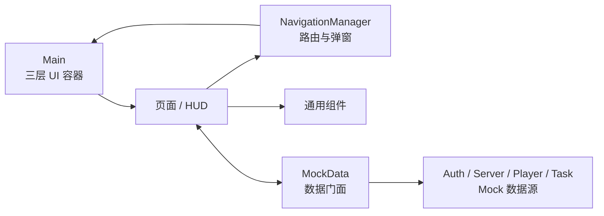

# 代码架构文档

> 适用版本：Godot 4.7.1；当前实现为移动端横屏低保真 UI 与本地 Mock 演示层。

## 1. 架构概览

项目采用“主容器 + 集中导航 + 页面/组件分离 + Mock 数据门面”结构。



运行入口为 `res://main/main.tscn`。`Main` 提供三个互相独立的显示层：

| 层 | 职责 |
| --- | --- |
| `ScreenLayer` | 登录、加载、开始、选服、HUD 和占位页面 |
| `DialogLayer` | 确认、提示、错误弹窗 |
| `OverlayLayer` | 全屏加载遮罩 |

## 2. 目录职责

```text
res://
├─ main/                 # 主场景与三层 UI 容器
├─ mock/                 # 本地测试数据及统一数据门面
└─ ui/
   ├─ screens/           # 登录、加载、开始、选服、组件演示
   ├─ hud/               # 游戏主界面
   ├─ components/        # 资源、任务、地图等复用组件
   ├─ dialogs/           # 通用弹窗与加载遮罩
   ├─ placeholders/      # 尚未开发的独立功能页面
   ├─ scripts/           # 导航、安全区域、UI 构建工具
   └─ themes/            # 公共 Theme
```

主要文件：

- `main/main.gd`：注册三层容器并进入登录页。
- `ui/scripts/navigation_manager.gd`：集中维护路由、历史栈、弹窗与遮罩。
- `mock/mock_data.gd`：页面访问数据的唯一门面。
- `ui/hud/main_hud.gd`：组装资源栏、任务栏、地图区域和功能入口。
- `ui/components/map_area.tscn`：地图 `SubViewport` 挂载点。
- `ui/scripts/safe_area_container.gd`：移动端安全区域适配。
- `ui/scripts/ui_builder.gd`：公共控件工厂、颜色与状态样式。

## 3. Autoload

| 名称 | 文件 | 职责 |
| --- | --- | --- |
| `NavigationManager` | `res://ui/scripts/navigation_manager.gd` | 页面切换、返回、弹窗和加载遮罩 |
| `MockData` | `res://mock/mock_data.gd` | 登录、服务器、玩家状态和任务的本地数据门面 |

`NavigationManager` 不保存玩法状态；`MockData` 不保存 UI 节点引用。

## 4. 页面导航

主流程：

```text
登录 → 本地加载 → 开始
                  ├─ 服务器选择
                  ├─ 进入 HUD
                  └─ 退出登录 → 登录
```

正式路由包括 `login`、`loading`、`start`、`server_select`、`main_hud` 和 `ui_demo`。设置、城池、武将、联盟、战前路线、战斗指令、NPC、全服事件、赛季、流亡、复兴、反攻均为独立占位路由。

导航规则：

- 页面只调用 `open_screen()`、`replace_screen()` 或 `go_back()`，不访问其他页面内部节点。
- 可选场景加载前通过 `ResourceLoader.exists()` 检查。
- 场景缺失时保留当前页面并显示通用提示。
- 同一路由不会重复打开；页面切换时旧页面进入释放流程。
- 弹窗与加载遮罩不进入页面历史栈。

## 5. 数据流

页面通过 `MockData` 获取快照，并监听以下信号：

| 信号 | 数据 |
| --- | --- |
| `auth_changed` | 登录状态发生变化 |
| `selected_server_changed(server)` | 当前服务器变化 |
| `resources_changed(resources, changes)` | 资源新值与本次变化量 |
| `tasks_changed(tasks)` | 完整任务快照 |

数据源划分：

- `MockAuthData`：登录身份与记住账号。
- `MockServerData`：服务器列表和当前服务器。
- `MockPlayerData`：资源与更多状态。
- `MockTaskData`：任务列表、追踪状态和演示推进。

正式后端接入时，应在数据层完成网络字段到现有 UI 字段的转换，页面与组件不直接解析 HTTP 响应。

## 6. 组件协作

- `ResourceBar` 接收资源字典，通过信号请求更多状态或演示更新。
- `ResourceItem` 负责数值格式化和增减反馈，不计算正式经济数值。
- `TaskPanel` 根据任务数组创建 `TaskItem`。
- `TaskItem` 只展示任务、折叠详情并发出查看/追踪信号。
- `MainHUD` 连接组件信号与 `MockData`，并在退出场景树时断开全局信号。
- 通用弹窗通过 `configure()` 接收文案，通过信号返回确认、取消或关闭结果。

## 7. 地图边界

地图挂载点为：

```text
MapArea/MapViewportContainer/MapViewport
```

`MapViewport` 只提供地图场景容器；`MapUILayer` 用于地图上方的屏幕空间 UI。当前 `map_input_anchor.gd` 只保留单指拖拽、双指缩放等手势接入位置，不包含地图、相机或业务逻辑。

## 8. 扩展约束

- 新页面使用独立 `.tscn` 和控制脚本，并注册到集中路由表。
- 页面间通信使用导航参数、数据门面或信号。
- 公共组件不得反向依赖具体业务页面。
- 网络、地图、战斗和经济逻辑不得写入视觉组件。
- 全局信号必须防止重复连接，并在页面释放时断开。
- UI 继续使用容器、锚点、安全区域和 Theme，避免固定全屏坐标。

## 9. 当前限制

- 没有真实账号认证、服务器请求、存档或实时推送。
- 数值变化、任务推进和加载进度均为本地演示。
- 地图仅有挂载节点和输入预留。
- 城池、武将、联盟、战斗和赛季等页面尚未实现正式内容。

